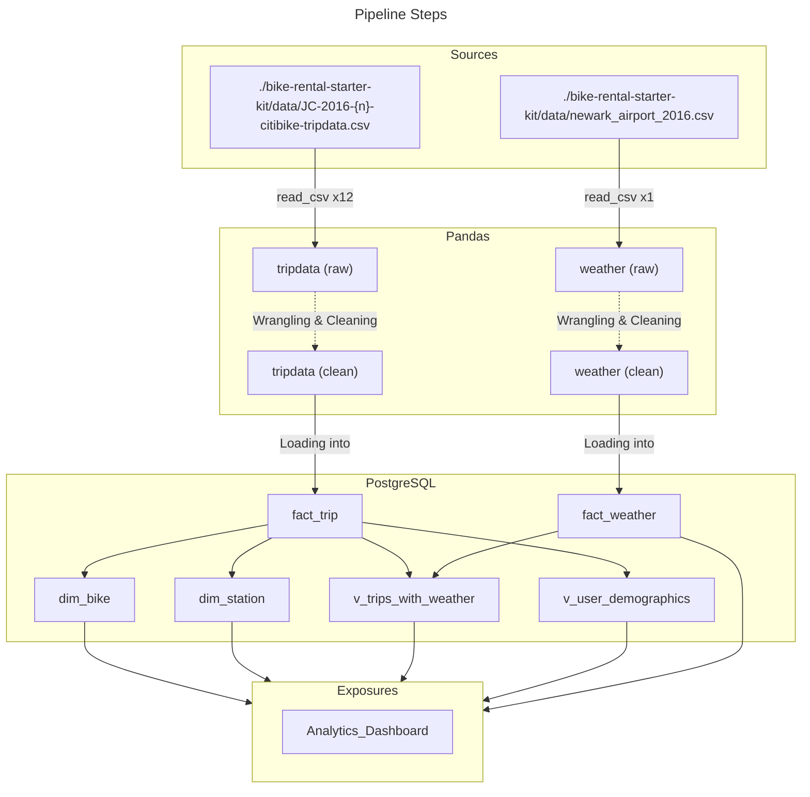
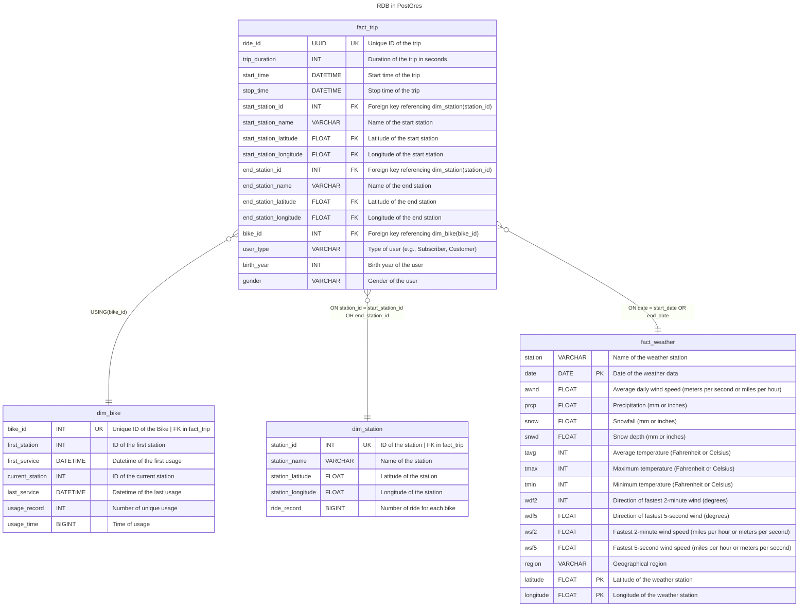

# Citi Bike Ridership and NOAA Weather Data Integration Project
## Overview
This project involves exploring, cleaning, and merging Citi Bike ridership data with NOAA weather data to create a PostgreSQL database with analytics-ready views. The goal is to assist a bike rental company's analysts in understanding the impact of weather on bike rentals. The project spans data exploration, cleaning, validation, designing a relational database, and developing SQL views to facilitate analytics.

## Project Objectives
**1. Data Exploration and Cleaning:**

* Utilize Jupyter notebooks and Pandas to explore, clean, and transform the provided Citi Bike ridership data and NOAA weather data.
* Address missing values, outliers, and any inconsistencies in the datasets.

**2. Relational PostgreSQL Database Design:**

* Design and implement a relational PostgreSQL database schema to store the integrated data.
* Establish relationships between tables to ensure data integrity.

**3.SQL Analytics-Ready Views:**

* Develop SQL queries to create analytics-ready views within the PostgreSQL database.
* These views should enable the analytics team to analyze the relationship between weather conditions and bike rentals effectively.

## Project Structure

The project is organized into the following sections:

**1. Data Cleaning :**

Explore and clean Citi Bike ridership and NOAA weather data using Jupyter notebooks and Pandas.

**2. Database Design (PostgreSQL):**

Design a relational PostgreSQL database schema based on the cleaned data.
Implement the database schema and load the integrated data into PostgreSQL.

**3. SQL Views :**

Develop SQL queries to create analytics-ready views in the PostgreSQL database.
Ensure that the views provide meaningful insights into the relationship between weather and bike rentals.

### Documentation:

> [/data](bike-rental-starter-kit/data)
> 
> * [newark_airport_2016.csv](/bike-rental-starter-kit/data/newark_airport_2016.csv) : weather data from Newark airport
> * [JC-2016xx-citibike-tripdata.csv](/bike-rental-starter-kit/data/JC-201601-citibike-tripdata.csv) : twelve files each containing one month of Citi Bike data from Jersey City
>
> [/data-dictionaries](/bike-rental-starter-kit/data-dictionaries)
> * [citibike.pdf](/bike-rental-starter-kit/data-dictionaries/citibike.pdf) : details on the Citi Bike data files from Citi Bike’s website
> * [weather.pdf](/bike-rental-starter-kit/data-dictionaries/weather.pdf) : details on the weather data from NOAA’s website

## Technical Write-Up
### 1. Data Cleaning and Transformation Decisions

### Tripdata

1. Data Type Normalization:

*  Converted 'int64' columns to 'Int64' for type standardization.
* Converted 'float64' to 'Int64' for 'Birth Year'.
* Normalized 'object' columns to title case for readingness.

2. Mapping:

* Mapped 'Gender' values (1 and 2) to 'male' and 'female' so analyst would not map it later.
* Mapped 'Subscriber' to 'Casual' and 'Customer' to 'Member'.

3. Dealing with outliers:

* Kept only trips with a duration under 7 days.
* Removed records where 'Birth Year' is before 1916, considering nobody over 100 years old would use bike rental services.

4. UUID Generation:

Created a new 'Ride ID' column using UUIDs, which will be used as a primary key of `fact_trip` in PostgreSQL database.

### Weather

1. Name/Region Split:

* Split 'NAME' into 'NAME' and 'REGION' columns.

2. Column Handling:

* Removed columns where all values are NaN.
* Added fixed 'Latitude' and 'Longitude' to map station to weather data more precisely.  

### 2. Views Creation:

#### dim_station
The materialized view dim_station is useful for providing a precomputed summary of bike station information based on the fact_trip table. By aggregating data on start stations, including their unique identifiers, names, geographical coordinates, and the count of distinct ride records, this materialized view offers quick access to summarized station statistics. Analysts can efficiently retrieve station details and ride records without repeatedly recalculating aggregations, improving query performance for applications such as station popularity analysis or reporting.

```SQL
CREATE MATERIALIZED VIEW dim_station AS
SELECT 
	distinct start_station_id as station_id,
	start_station_name as station_name,
	start_station_latitude as station_latitude,
	start_station_longitude as station_longitude,
	count(distinct ride_id)	as ride_record
FROM fact_trip ft
GROUP BY 
	station_id,station_name,station_latitude,station_longitude
```

#### dim_bike
The materialized view dim_bike is useful for summarizing bike-related information, including the unique bike identifiers, the first and current station of each bike, its first and last service times, the total usage record count, and the cumulative usage time. This precomputed summary enhances query performance for analyzing bike usage patterns and tracking the historical movement of bikes over time. Analysts can efficiently retrieve key bike metrics without recomputing these aggregations on the raw data.

```SQL
CREATE MATERIALIZED VIEW dim_bike AS
SELECT 
	distinct bike_id,
	FIRST_VALUE(start_station_id) OVER (PARTITION BY bike_id ORDER BY start_time asc) as first_station,
	MIN(start_time) OVER (PARTITION BY bike_id) as first_service,
	FIRST_VALUE(start_station_id) OVER (PARTITION BY bike_id ORDER BY stop_time desc) as current_station,
	MAX(start_time) OVER (PARTITION BY bike_id) as last_service,
	COUNT(ride_id) OVER (PARTITION BY bike_id) as usage_record,
	SUM(trip_duration) OVER (PARTITION BY bike_id) as usage_time
FROM fact_trip ft
```

#### v_trips_with_weather
Analysts can use this view to analyze bike trips alongside relevant weather information. For example, they can explore how weather conditions like wind speed, precipitation, and temperature correlate with trip durations or user behaviors.
 
```SQL
CREATE VIEW v_trips_with_weather AS
SELECT
    ft.*,
    fw.*
FROM
    fact_trip ft
JOIN fact_weather fw ON ft.start_time::date = fw.date::date; 
```

#### v_user_demographics
Analysts can use this view to analyze the average age and gender distribution of bike users based on user types (e.g., Subscribers, Customers). Understanding user demographics can inform marketing strategies or service improvements.
 
```SQL
CREATE VIEW v_user_demographics AS
SELECT
    user_type,
    AVG(EXTRACT(YEAR FROM age(current_date, TO_DATE(birth_year::text, 'YYYY')))) AS avg_age,
    gender
FROM
    fact_trip
WHERE
    birth_year IS NOT NULL
GROUP BY
    user_type, gender;

```

## ETL Pipeline Schema



## RDB Schema


