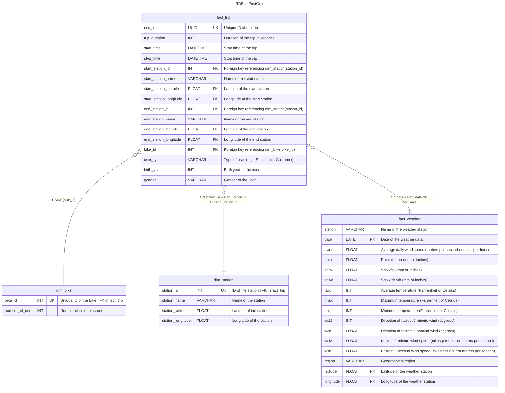

# Technical Write-up

File architectire : 

## ETL Pipeline Schema

## RDB Schema

<!--
     "./bike-rental-starter-kit/data/JC-2016{n}-citibike-tripdata.csv" }o--|| "Pandas" : "Exploring & Cleaning"
    "Pandas" ||--|| "PostGres" : Loading
    "PostGres" ||--|| "fact_trip" : Managing

  "./bike-rental-starter-kit/data/newark_airport_2016.csv" }o--|| "Pandas" : "Exploring & Cleaning"
    "Pandas" ||--|| "PostGres" : Loading
    "PostGres" ||--|| "fact_weather" : Managing 
-->
